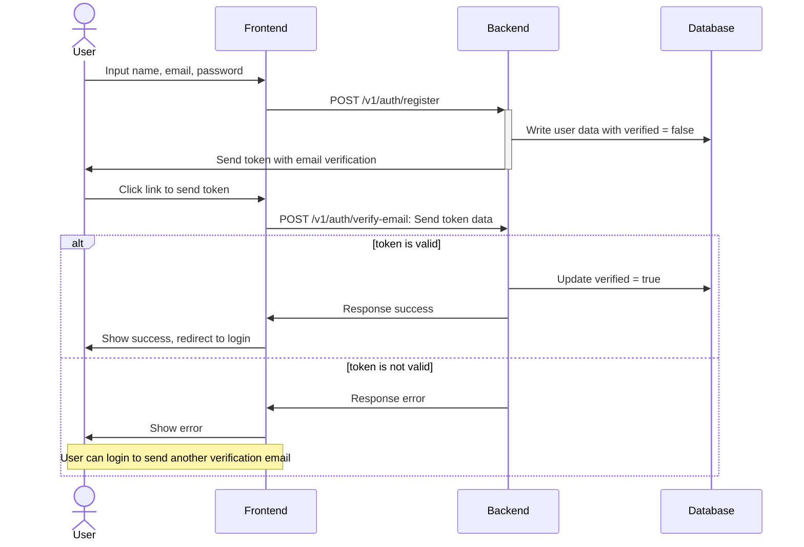
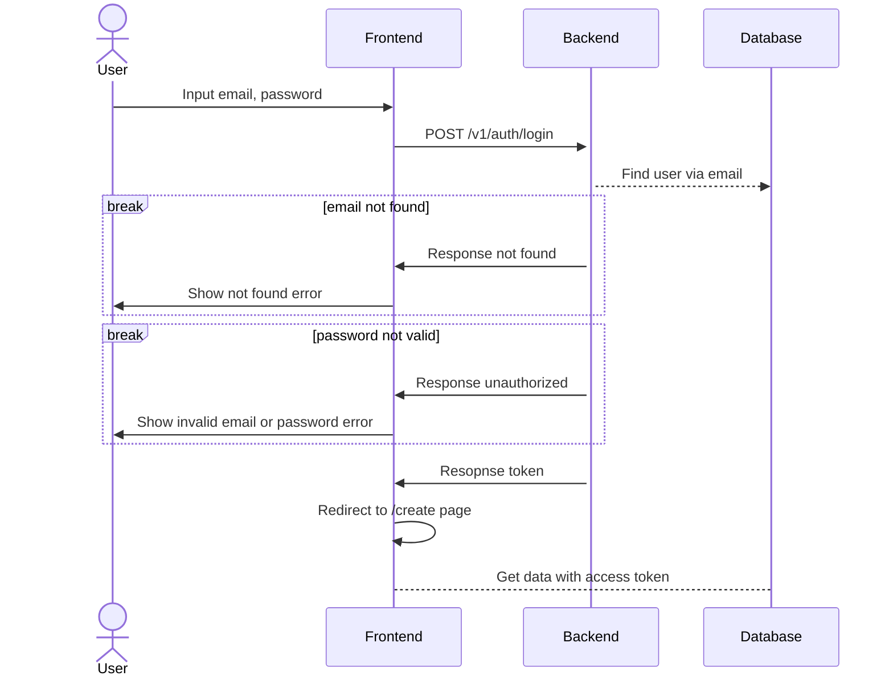
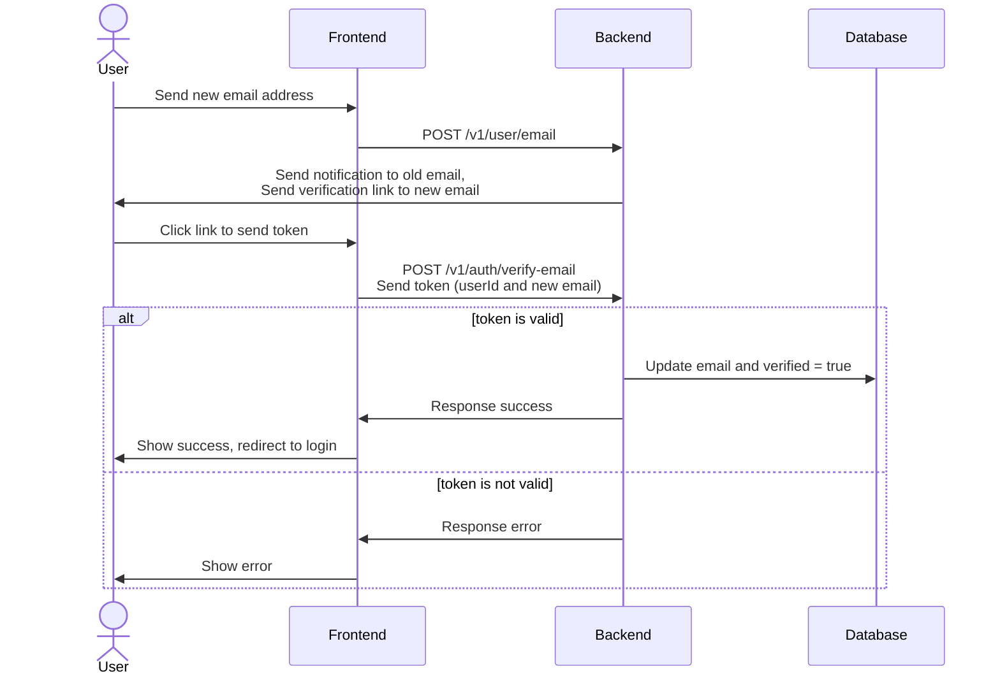
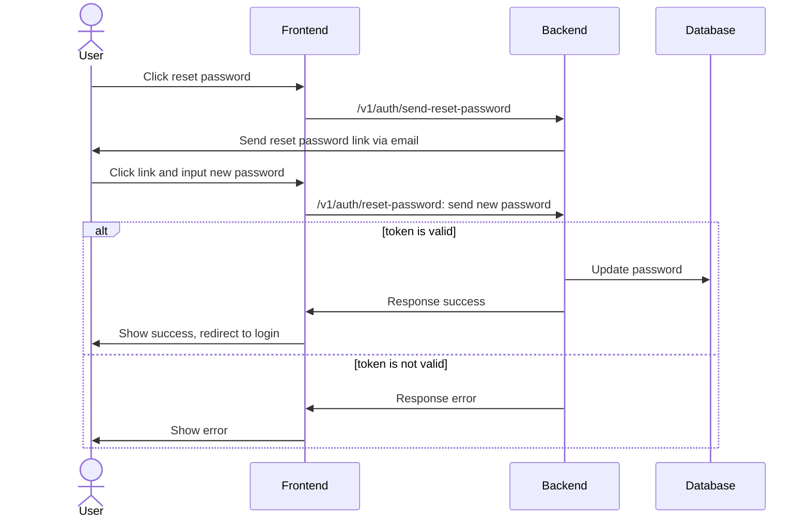

# Introduction

This is an API service for create resume data. Using Express.js framework and hosted in Firebase.
You can use it to create your resume <a href="https://themiddnight.github.io/#/create" target="_blank">here</a>. 
And see my example resume <a href="https://themiddnight.github.io/" target="_blank">here</a>.

# Routes

These are all routes in the project. Grouped by the project's Express Router files:

**/v1/auth**
| Method | Route | Descriptions |
|--------|-------|--------------|
| **POST** | /login | Create and send the JWT token |
| **POST** | /register | Create user data (with verified = false) and send verification email to user |
| **POST** | /send-verification-email | For resending a verification email |
| **POST** | /send-reset-password | For sending a reset password link via email |
| **POST** | /verify-email | Check the token (from user's email) and update user email, verified = true |
| **POST** | /reset-password | Update new password with token check (from user's email) |

**/v1/user** <br> User ID token needed
| Method | Route | Descriptions |
|--------|-------|--------------|
| **GET** | / | Get user data and their resumes list |
| **POST** | /name | Update user name |
| **POST** | /email | Send an email change notification to user's old email, and verify new email to user's new email |
| **DELETE** | / | Delete user, user's resume and user's storage data |
    
**/v1/resume** <br> User ID token needed, except **GET** /:resumeId
| Method | Route | Descriptions |
|--------|-------|--------------|
| **GET** | /:resumeId | Get all data of a resume (to use in the public resume page) |
| **GET** | /:resumeId/summary | Get resume's summary data (owner name, resume name, active data) |
| **POST** | / | Create an blank resume with template data |
| **PATCH** | /:resumeId | Update resume name or active status |
| **DELETE** | /:resumeId | Delete resume data and it's storage |
    
**/v1/public_notes** <br> This is some social features that let anyone can post some messages to anyone's resume
| Method | Route | Descriptions |
|--------|-------|--------------|
| **GET** | /:resumeId/public_notes | Get all messages |
| **POST** | /:resumeId/public_notes | Create a new message |
| **DELETE** | /:resumeId/public_notes/:noteId | Delete a message |
    
**/v1/edit** <br> Each resume's section. Each section has **/GET** and **/PUT**
- /:resumeId/settings
- /:resumeId/about
- /:resumeId/certifications
- /:resumeId/collections
- /:resumeId/education
- /:resumeId/experiences
- /:resumeId/languages
- /:resumeId/other_links
- /:resumeId/profile
- /:resumeId/projects
- /:resumeId/public_notes
- /:resumeId/skills

# Data structures

This project use Firestore as a database, which is a No-SQL. And Firebase Storage to store image files.

**User collection:**
```
{
  name: string, 
  email: string, 
  password: string, 
  verified: string
}
```

**Resume collection:**
```
{
  resume_name: string,
  user_id: string,
  created_at: date,
  active: boolean
}
```
**Resume subcollections (overview):** <br>
```
data: {
  settings: object,
  about: object,
  certifications: object,
  collections: object,
  education: object,
  experiences: object,
  languages: object,
  other_links: object,
  profile: object,
  projects: object,
  public_notes: object,
  skills: object,
}

public_notes: {
  content: string,
  number: number,
  createdAt: date
}
```

**Resume data subcollections (detail)** <br>
Note: These following attributes are additional data needed when submited...
- ***image_file: base64** Image file in base64 string
- ***deleted_image_paths: string[]** List of Firebase storage file path to be removed (when delete resume data, remove image, etc.)
<details>
  <summary>settings</summary>

  ```
    layout: number,
    background": {
      mode: number,
      color: string,
      image_url: string,
      image_path: string
      *image_file: base64,
    },
    intro: {
      title: string,
      subtitle: string,
      enter_button: string
    }
  ```
</details>

<details>
  <summary>profile</summary>
  
  ```
    subtitle: string,
    image_url: string,
    image_path: string,
    *image_file: base64,
    contact: {
      location: string,
      email: string,
      phone: string,
    }
    links: [
      {
        title: string,
        url: string
      },
    ]
  ```
</details>

<details>
  <summary>about</summary>

  ```
    active: boolean,
    title: string,
    subtitle: string,
    data: [
      { content: string },
    ]
  ```
</details>

<details>
  <summary>education</summary>

  ```
    active: boolean,
    title: string,
    subtitle: string,
    display_limit: number,
    data: [
      {
        active: boolean,
        title: string,
        degree: string,
        school: string,
        from: string,
        to: string,
        current: boolean
      },
    ]
  ```
</details>

<details>
  <summary>experiences</summary>

  ```
    active: boolean,
    title: string,
    subtitle: string,
    display_limit: number,
    data: [
      {
        active: boolean
        title: string
        company: string
        from: string
        to: string
        current: boolean
        description: [
          { content: string },
        ]
      },
    ]
  ```
</details>

<details>
  <summary>projects</summary>

  ```
    active: boolean,
    title: string,
    subtitle: string,
    display_limit: number,
    display_mode: number,
    data: [
      {
        title: string,
        tags: string[],
        image_url: string,
        image_path: string,
        *image_file: base64,
        description: string,
        public_link: string,
        createdAt: string,
        links: [
          {
            title: string,
            url: string
          },
        ]
      },
    ]
    *deleted_image_paths: string[]
  ```
</details>

<details>
  <summary>skills</summary>

  ```
    active: boolean,
    title: string,
    subtitle: string,
    display_limit: number,
    data: [
      {
        active: boolean,
        title: string,
        level: string,
        description: string,
        image_url: string,
        image_path: string,
        *image_file: base64,
        isMono: boolean
      }
    ]
    *deleted_image_paths: string[]
  ```
</details>

<details>
  <summary>collections</summary>

  ```
    active: boolean,
    title: string,
    subtitle: string,
    display_limit: number,
    data: [
      {
        active: boolean,
        title: string,
        description: string,
        image_url: string,
        image_path: string,
        *image_file: base64,
        isMono: boolean
      }
    ]
    *deleted_image_paths: string[]
  ```
</details>

<details>
  <summary>languages</summary>

  ```
    active: boolean,
    title: string,
    subtitle: string,
    display_limit: number,
    read: { value: number, level: string },
    write: { value: number, level: string },
    listen: { value: number, level: string },
    speak: { value: number, level: string },
  ```
</details>

<details>
  <summary>certifications</summary>

  ```
    active: boolean,
    title: string,
    subtitle: string,
    display_limit: number,
    data: [
      {
        active: boolean,
        title: string,
        issuedBy: string,
        issuedDate: string,
        credentialUrl: string,
        image_url: string,
        image_path: string,
        *image_file: base64,
      },
    ],
    *deleted_image_paths: string[]
  ```
</details>

<details>
  <summary>other_links</summary>

  ```
    active: boolean,
    title: string,
    subtitle: string,
    display_limit: number,
    data: [
      { title: string, url: string },
    ]
  ```
</details>

<details>
  <summary>public_notes</summary>

  ```
    active: boolean,
    title: string,
    subtitle: string,
    display_limit: number,
  ```
</details>

# Auth workflow
**Register**


---

**Login**


---

**Change email**


---

**Reset password**



# Todo next

- Now the access token expires in 1 day. I will change it to be less lifetime and create another refresh token for more security.
- Implement social login.
- Implement Redis cache to reduce reading the firestore database directly.
- Make user can create API key so user can access their own raw data.
